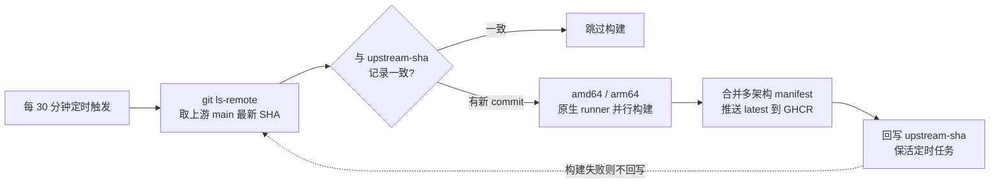

# sub2api-monitor

自动跟踪上游 [Wei-Shaw/sub2api](https://github.com/Wei-Shaw/sub2api) 的 `main` 分支，构建多架构 Docker 镜像并发布到 GHCR。

上游更新频繁，但只在发布 release 时才出镜像，平时 push 修复的小 bug 拿不到。本仓库补上这一环：**每 30 分钟检查一次上游 `main` 是否有新 commit，有才构建，没有就直接结束**（无变化时只跑一个几十秒的 check job，几乎不消耗 Actions 时间；公开仓库的 Actions 本身免费）。

## 镜像

```
ghcr.io/arsonist-g/sub2api:latest   # linux/amd64 + linux/arm64
```

镜像 label `org.opencontainers.image.revision` 记录了对应的上游 commit SHA。

## 工作方式



- 状态记录在仓库根的 `upstream-sha` 文件里，构建成功后由 `github-actions[bot]` 提交回写；该提交同时让仓库保持活跃，避免 GitHub 禁用 60 天无活动的 scheduled workflow（上游长期停更时需手动重新启用 Actions）。
- amd64 / arm64 各用原生 runner 构建（上游 Dockerfile 使用 `BUILDPLATFORM` 交叉编译，无需 QEMU），以 `latest-amd64` / `latest-arm64` 为中转 tag，最后合并出多架构 `latest`，不产生历史版本 tag。
- 构建失败不回写 SHA，下个周期会对同一 commit 自动重试。

## 已知取舍

跟随上游 `main` 意味着拿到的可能是未经 release 验证的代码：修复来得快，但偶尔也可能碰到上游刚提交的问题。回滚方式：把部署处的镜像指回 `ghcr.io/wei-shaw/sub2api:latest` 即可。
